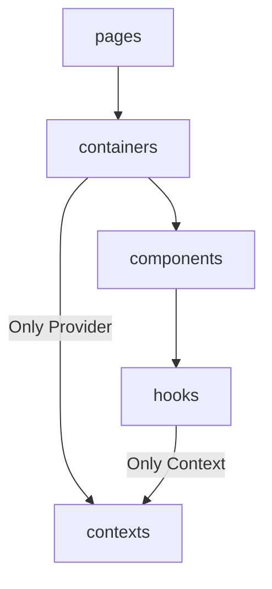

[](https://codecov.io/gh/taco3064/kekkai-structure-lint)

**English** | [繁體中文](https://github.com/taco3064/kekkai-structure-lint/blob/main/README.zh-TW.md)

# @kekkai/structure-lint

A **config-driven** ESLint structure rule generator that enforces **one-way folder dependency flow** in your project, with a separate CLI for syncing and validating dependency rules in documentation.

## 🔍 What Problem Does This Solve?

In medium to large front-end projects, folder structures tend to degrade over time:

- Modules can freely import each other without clear boundaries
- Relative imports (`../`) make dependency relationships hard to reason about
- Architecture rules live only in documentation, not in tooling
- Documentation and actual code gradually drift apart

`@kekkai/structure-lint` is not about code style.  
Its goal is to **turn folder structure and dependency direction into enforceable ESLint rules**.

> ⚠️ **ESLint v9+ Required**
>
> This package is built for **ESLint Flat Config**  
> and requires **ESLint v9 or later**.
>
> If your project is still using legacy `.eslintrc`,
> please migrate to Flat Config before using this package.

## ✨ Core Ideas

This package is built on three core ideas:

1. **Folder-as-a-Module**
   - Treat each subfolder as a standalone module (e.g. `hooks/useShuffleCards`, `components/Card`)
   - Prefer `index.ts` as the module entry to keep imports consistent and readable

2. **One-way Dependency Flow**
   - Dependency rules are defined at the folder level: each folder may only depend on allowed downstream folders
   - No reverse dependencies and no layer-skipping shortcuts

3. **Enforceable Imports (Alias-only Cross-folder Imports)**
   - Relative imports (`./`) are allowed within a module
   - Cross-folder imports must use the project alias (e.g. `~app/...`) to prevent uncontrolled `../` shortcut dependencies

> 🗂️ **Example Folder Structure:**
>
> ```text
> src/
> ├─ components/
> │  └─ Card/
> │     ├─ Component.tsx
> │     ├─ index.ts
> │     └─ types.ts
> ├─ containers/
> │  └─ DeckDrawStage/
> │     ├─ Container.tsx
> │     ├─ index.ts
> │     └─ types.ts
> └─ main.tsx
> ```

## 📥 Installation

```bash
npm install -D @kekkai/structure-lint
```

This package provides:

- An ESLint Flat Config generator
- A standalone CLI for documentation sync and validation

## 🚀 Quick Start

- **eslint.config.(js|ts)**
  `@kekkai/structure-lint` supports two usage patterns.
  Choose the one that best fits your project needs:

  ```ts
  import { defineConfig } from 'eslint/config';
  import { createStructureLint } from '@kekkai/structure-lint';

  export default defineConfig([
    // Options 1. Use structure.config.json
    ...structure.defineConfig(),

    // Options 2. Define rules directly in eslint.config.ts
    ...structure.defineConfig({
      appAlias: '~app',
      lintFiles: 'src/{folder}/**/*.{ts,tsx}',
      dependencyFlow: [
        ['pages', 'layouts'],
        ['layouts', 'containers'],
        ['containers', 'components'],
        ['components', 'hooks'],
      ],
    }),
  ]);
  ```

- **CLI**
  `@kekkai/structure-lint` provides a standalone CLI to **sync Dependency Flow rules into a specified Markdown file**.

  ```bash
  npx structure-lint
  ```

  > 💡 The CLI reads **only** `structure.config.json`.

## 🧩 structure.config.json

`structure.config.json` is used to define folder dependency rules and documentation sync settings for the project.
This file is read by both:

- ESLint configuration (createStructureLint())
- CLI (npx structure-lint)

### 🔧 Configuration Options

```ts
{
  /**
   * appAlias
   *   type (required):
   *   - string
   *
   * The module alias used in the project to enforce a unified import path
   * for cross-folder dependencies.
   * - All cross-folder imports MUST use this alias
   * - Replaces unsafe and hard-to-track `../` relative imports
   */
  "appAlias": "~app",

  /**
   * lintFiles
   *   type (required):
   *   - string | string[]
   *
   * Specifies the file paths where ESLint structure rules should be applied.
   * - Must include the `{folder}` placeholder
   * - `{folder}` will be replaced at runtime with each folder name
   *   defined in `dependencyFlow`
   */
  "lintFiles": "src/{folder}/**/*.{ts,tsx}",

  /**
   * moduleLayout
   *   type (optional)
   *   - 'folder' | 'flat'
   *
   * Controls how modules are structured within each layer and how
   * relative import restrictions are generated.
   *
   * - 'folder' (default):
   *   Each module lives in its own subfolder (e.g. components/Card/*),
   *   and imports are only allowed via the module entry.
   *
   * - 'flat':
   *   Modules are represented directly by files under the layer
   *   (e.g. components/Card.tsx).
   *
   * Default: 'folder'
   */
  "moduleLayout": "folder",

  /**
   * dependencyFlow
   *   type (required):
   *   - [
   *       string, // from folder
   *       string, // to folder
   *       {
   *         description?: string; // Used only for documentation output
   *                               // (Mermaid flowchart annotation),
   *                               // does NOT affect ESLint rules
   *         selfOnly?: boolean;   // When true, the from folder may only
   *                               // directly depend on the to folder,
   *                               // with no further downstream extension
   *       }?
   *     ][]
   *
   * Defines one-way dependency relationships between folders.
   */
  "dependencyFlow": [
    ["pages", "containers"],
    ["containers", "contexts", { description: "Only Provider" }],
    ["containers", "components"],
    ["components", "hooks"],
    ["hooks", "contexts", { description: "Only Context", selfOnly: true }]
  ],

  /**
   * docs
   *   type (optional)
   *   - {
   *       file: string;      // Target Markdown file path
   *       markerTag: string; // Identifier used to locate the auto-generated block
   *       content?: string;  // Custom documentation content
   *     }
   *
   * Configures the CLI to sync `dependencyFlow` into a Markdown file.
   */
  "docs": {
    "file": "README.md",
    "markerTag": "DEPENDENCY_RULE"
  },

  /**
   * overrideRules
   *   type (optional)
   *   - {
   *       [key: string]:       // Key must be a folder name defined in dependencyFlow
   *         EslintRulesConfig; // ESLint rules configuration object
   *     }
   *
   * Overrides or extends ESLint rules for specific folders.
   */
  "overrideRules": {
    "contexts": {
      "react-refresh/only-export-components": "off"
    }
  },

  /**
   * packageImportRules
   *   type (optional)
   *   - {
   *       name: string;           // npm package name
   *       importNames?: string[]; // Restrict specific named imports only.
   *                               // If omitted, the entire package is restricted
   *       allowedInFolders: F[];  // Folders where this import is allowed
   *     }[]
   *
   * Restricts specific packages or named imports to designated folders only.
   */
  "packageImportRules": [
    {
      "name": "react",
      "importNames": ["createContext"],
      "allowedInFolders": ["contexts"]
    },
    {
      "name": "react",
      "importNames": ["useContext"],
      "allowedInFolders": ["hooks"]
    }
  ]
}
```

The `dependencyFlow` configuration above produces the following Mermaid flowchart:



Based on the `markerTag` configuration, the CLI will locate and overwrite the following block in the target Markdown file:

```md
<!-- DEPENDENCY_RULE:START -->
<!-- DEPENDENCY_RULE:END -->
```

## 🔁 Circular Dependencies (Optional)

`@kekkai/structure-lint` enforces one-way dependency flow **across layers**,
but intentionally allows **same-layer imports as a design trade-off**.

As a result, circular dependencies may still occur within the same layer.
This is usually acceptable for small modules, but may become risky as the codebase grows.

If your team wants to detect these cases, you can optionally enable:

- `import/no-cycle` (from [`eslint-plugin-import`](https://www.npmjs.com/package/eslint-plugin-import))

> ⚠️ **TypeScript projects must configure a resolver**, otherwise circular dependencies may not be detected.
> Try [`eslint-import-resolver-typescript`](https://www.npmjs.com/package/eslint-import-resolver-typescript).

```ts
import imports from 'eslint-plugin-import';
import { defineConfig } from 'eslint/config';
import { createStructureLint } from '@kekkai/structure-lint';

export default defineConfig([
  {
    plugins: {
      import: imports,
    },
    settings: {
      'import/parsers': {
        // Project file extensions handled by the TypeScript parser
        '@typescript-eslint/parser': ['.ts', '.tsx'],
      },
      'import/resolver': {
        typescript: true,
        node: {
          // Project file extensions used for module resolution
          extensions: ['.ts', '.tsx'],
        },
      },
    },
    rules: {
      'import/no-cycle': 'error',
    },
  },
  ...createStructureLint(),
]);
```

## 🧠 Philosophy

`@kekkai/structure-lint` treats folder structure as architecture.

You define the dependency rules.  
ESLint enforces them.  
Documentation stays in sync.

Designed for teams that care about **clarity**, **maintainability**,  
and **long-term structural consistency**.
