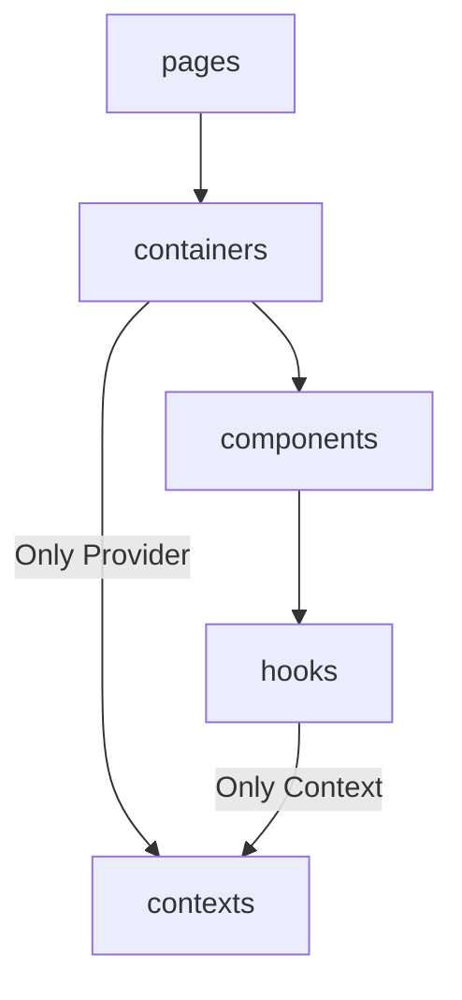

[English](https://github.com/taco3064/kekkai-structure-lint/blob/main/README.md) | **繁體中文**

# 📦 @kekkai/structure-lint

一個 **config-driven** 的 ESLint 結構規則產生器，用來強制專案遵守 **單向資料夾依賴（One-way Dependency Flow）**，並提供獨立 CLI 來同步與驗證專案文件中的依賴規則說明。

## 🔍 What Problem Does This Solve?

在中大型前端專案中，資料夾結構往往隨著功能成長而逐漸失控：

- 模組之間可以隨意互相 import
- 相對路徑（../）跨層引用，難以追蹤實際依賴關係
- 架構規則只存在於文件，無法被工具驗證
- 文件與實際程式碼逐漸脫節

@kekkai/structure-lint 的目的不是「規範寫法」，而是 **把資料夾結構與依賴方向，轉換成可被 ESLint 強制執行的規則**。

> ⚠️ **ESLint v9+ Required**
>
> 本套件基於 **ESLint Flat Config** 設計，  
> 僅支援 **ESLint v9 以上版本**。
>
> 如果你的專案仍使用 `.eslintrc`（legacy config），  
> 請先升級至 Flat Config 架構後再使用本套件。

## ✨ Core Ideas

這個套件建立在三個核心概念之上：

1. **Folder-as-a-Module**
   - 每個子資料夾視為一個獨立模組（例如 `hooks/useShuffleCards`、`components/Card`）
   - 建議使用 `index.ts` 作為模組入口，讓引用點一致且可讀

2. **One-way Dependency Flow**
   - 依賴關係以「資料夾層級」定義：每個資料夾只能依賴允許的下游資料夾
   - 不允許逆向依賴，也不允許跨層跳轉

3. **Enforceable Imports (Alias-only Cross-folder Imports)**
   - 模組內部允許相對路徑（`./`）
   - 跨資料夾引用一律使用專案 alias（例如 `~app/...`），避免 `../` 形成不可控的捷徑依賴

> 🗂️ **Example Folder Structure:**
>
> ```text
> src/
> ├─ components/
> │  └─ Card/
> │     ├─ Component.tsx
> │     ├─ index.ts
> │     └─ types.ts
> ├─ containers/
> │  └─ DeckDrawStage/
> │     ├─ Container.tsx
> │     ├─ index.ts
> │     └─ types.ts
> └─ main.tsx
> ```

## 📥 Installation

```bash
npm install -D @kekkai/structure-lint
```

本套件同時提供：

- ESLint Flat Config 的設定產生器
- 一個獨立的 CLI，用於文件同步與驗證

## 🚀 Quick Start

- **eslint.config.(js|ts)**
  `@kekkai/structure-lint` 支援兩種使用方式，請依專案需求選擇最合適的模式：

  ```ts
  import { defineConfig } from 'eslint/config';
  import { createStructureLint } from '@kekkai/structure-lint';

  export default defineConfig([
    // Options 1. 使用 structure.config.json
    ...createStructureLint(),

    // Options 2. 直接在 eslint.config.ts 中定義規則
    ...createStructureLint({
      appAlias: '~app',
      lintFiles: 'src/{folder}/**/*.{ts,tsx}',
      dependencyFlow: [
        ['pages', 'layouts'],
        ['layouts', 'containers'],
        ['containers', 'components'],
        ['components', 'hooks'],
      ],
    }),
  ]);
  ```

- **CLI**
  `@kekkai/structure-lint` 提供獨立的 CLI，用來將 Dependency Flow 規則同步到指定的 Markdown 文件 中。
  ```bash
  npx structure-lint
  ```
  > 💡 CLI 僅會讀取 structure.config.json。

## 🧩 structure.config.json

structure.config.json 用來定義專案的 資料夾依賴規則 與 文件同步設定。此檔案會同時被：

- ESLint 設定 (createStructureLint())
- CLI (npx structure-lint)

所讀取。

### 🔧 Configuration Options

```ts
{
  /**
   * appAlias
   *   type (required):
   *   - string
   *
   * 專案使用的模組 alias，用於強制跨資料夾 import 時的統一路徑格式。
   * - 所有跨 folder 的 import 必須 使用此 alias
   * - 用來取代不安全、不可控的 `../` 相對路徑
   */
  "appAlias": "~app",

  /**
   * lintFiles
   *   type (required):
   *   - string | string[]
   *
   * 指定 ESLint 要套用結構規則的檔案路徑。
   * - 必須包含 `{folder}` 佔位符
   * - `{folder}` 會在執行時自動替換為 dependencyFlow 中的每個資料夾名稱
   */
  "lintFiles": "src/{folder}/**/*.{ts,tsx}",

  /**
   * dependencyFlow
   *   type (required):
   *   - [
   *       string, // from folder
   *       string, // to folder
   *       {
   *         description?: string; // 僅用於文件輸出（Mermaid flowchart 註解），不影響 ESLint 規則
   *         selfOnly?: boolean;   // true 表示 from folder 只能直接依賴 to folder，不可再往下延伸依賴鏈
   *       }?
   *     ][]
   *
   * 定義資料夾之間的 單向依賴關係。
   */
  "dependencyFlow": [
    ["pages", "containers"],
    ["containers", "contexts", { description: "Only Provider" }],
    ["containers", "components"],
    ["components", "hooks"],
    ["hooks", "contexts", { description: "Only Context", selfOnly: true }],
  ],

  /**
   * docs
   *   type (optional)
   *   - {
   *       file: string;      // 要寫入的 Markdown 檔案路徑
   *       markerTag: string; // 用來標記自動產生區塊的識別字
   *       content?: string;  // 自定義文件說明內容
   *     }
   *
   * 設定 CLI 用來 同步 dependencyFlow 至 Markdown 文件。
   */
  "docs": {
    "file": "README.md",
    "markerTag": "DEPENDENCY_RULE"
  },

  /**
   * overrideRules
   *   type (optional)
   *   - {
   *       [key: string]:       // key 必須是 dependencyFlow 中出現過的資料夾名稱
   *         EslintRulesConfig; // value 為 ESLint rules 設定物件
   *     }
   *
   * 為特定資料夾覆寫或補充 ESLint 規則。
   */
  "overrideRules": {
    "contexts": {
      "react-refresh/only-export-components": "off
    }
  },

  /**
   * packageImportRules
   *   type (optional)
   *   - {
   *       name: string;           // npm 套件名稱
   *       importNames?: string[]; // 僅限制指定的 named imports。若省略，則限制整個套件
   *       allowedInFolders: F[];  // 允許使用該套件的資料夾清單
   *     }[]
   *
   * 限制 特定套件或特定 import 成員 只能在指定資料夾中使用。
   */
  "packageImportRules": [
    {
      "name": "react",
      "importNames": ["createContext"],
      "allowedInFolders": ["contexts"]
    },
    {
      "name": "react",
      "importNames": ["useContext"],
      "allowedInFolders": ["hooks"]
    }
  ]
}
```

`dependencyFlow` 設定對應的 mermaid flowchart 如下:



以範例中 `markerTag` 的設定，CLI 會尋找以下區塊並覆寫內容：

```md
<!-- DEPENDENCY_RULE:START -->
<!-- DEPENDENCY_RULE:END -->
```

## 🔁 Circular Dependencies (Optional)

`@kekkai/structure-lint` 會嚴格限制 **跨層** 的單向依賴方向，但仍刻意允許 **同一層內的模組彼此引用** 作為設計取捨。

因此，在相同 layer 之內，仍然可能發生循環依賴（circular dependencies）。
這在模組規模較小時通常是可接受的，但隨著專案成長，可能會逐漸帶來風險。

如果你的團隊希望進一步偵測這類情況，可以選擇性地啟用以下規則：

- `import/no-cycle` (from [`eslint-plugin-import`](https://www.npmjs.com/package/eslint-plugin-import))

> ⚠️ **TypeScript 專案必須正確設定 resolver**，否則可能無法偵測到循環依賴。
> 建議搭配使用 [`eslint-import-resolver-typescript`](https://www.npmjs.com/package/eslint-import-resolver-typescript)。

```ts
import imports from 'eslint-plugin-import';
import { defineConfig } from 'eslint/config';
import { createStructureLint } from '@kekkai/structure-lint';

export default defineConfig([
  {
    plugins: {
      import: imports,
    },
    settings: {
      'import/parsers': {
        // Project file extensions handled by the TypeScript parser
        '@typescript-eslint/parser': ['.ts', '.tsx'],
      },
      'import/resolver': {
        typescript: true,
        node: {
          // Project file extensions used for module resolution
          extensions: ['.ts', '.tsx'],
        },
      },
    },
    rules: {
      'import/no-cycle': 'error',
    },
  },
  ...createStructureLint(),
]);
```

## 🧠 Philosophy

`@kekkai/structure-lint` 將資料夾結構視為架構本身。

由你定義依賴規則，  
由 ESLint 強制執行，  
並確保文件與實際架構保持同步。

適合重視**可讀性、可維護性**與**長期結構一致性**的團隊。
