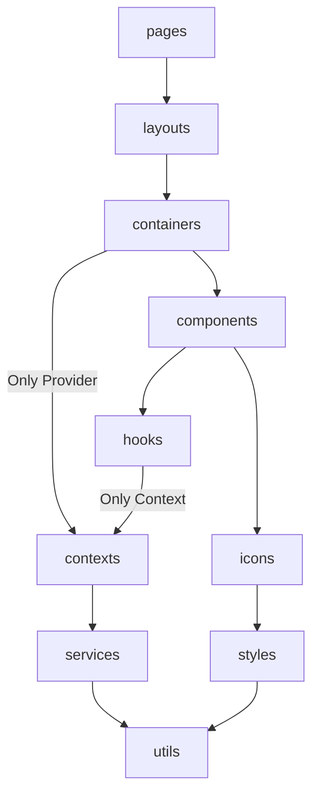

## Dependency Rule

<!-- DEPENDENCY_RULE:START -->

This project follows a **One-way Dependency Flow** principle:

- Each folder may only import modules that lie downstream along the arrow direction
- Upstream or reverse imports are not allowed

> This rule is also enforced via **ESLint**.

<!-- DEPENDENCY_RULE:END -->

## Custom Marker Test

<!-- CUSTOM_MARKER:START -->

Custom Content

<!-- CUSTOM_MARKER:END -->

<!-- MISSINF_END_MARKER:START -->
